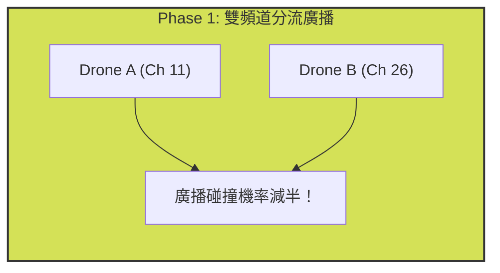

````carousel
# NS-3 Swarm Project
**網路架構版本演進與物理極限探索**

> [!NOTE]
> 本次報告將回顧專案自開發以來的 4 個核心架構版本，分析其物理現象與效能指標，並在最後分享開發過程中的「踩坑與失敗紀錄」。

**報告大綱：**
1. 核心版本總覽 (4 Versions)
2. V1 & V2：打破廣播天花板 (加入記憶機制)
3. V3：雙網卡突破極限 (全雙工與高密度碰撞)
4. V4：物理最穩定版 (近距離聚焦與 Capture Effect)
5. 🚫 踩坑紀錄：那些做了但沒有用的嘗試

<!-- slide -->
# 1. 核心版本總覽 (4 Versions)

| 版本名稱 / 核心機制 | 評估半徑 | Monitor Member List Match Ratio | Discovery Message Reception Ratio | Beacon Packet Reception Ratio | Mean Beacon Packet AoI | 版本意義與物理現象 |
| :--- | :--- | :--- | :--- | :--- | :--- | :--- |
| **1. 完全基礎版 (Baseline)**<br>有 CSMA，無記憶 | 100m | 64.6% | 70.4% | 24.2% | 136.3 ms | ⚠️ **Paper 基準點 (失憶症)**<br>沒聽到廣播 (30%) 就無法排程，吻合率被 Discovery 綁死。 |
| **2. Advanced Stability**<br>持久化記憶 + 智能避讓 | 100m | **87.7%** | 68.7% | 32.0% | 135 ms | ✅ **重大突破 (打破天花板)**<br>靠記憶盲猜對方的排程，Match Ratio 飛躍至 87.7%。 |
| **3. 雙廣播頻道架構版**<br>Ch11/Ch26 分流廣播 | 100m | 88.9% | **79.5%** | 34.1% | 211 ms | 🚀 **突破廣播極限 (偶發當機)**<br>雙網卡分流解決高密度碰撞，但 51ms 週期太緊導致 CSMA 當機。 |
| **4. 近距離聚焦 + 防當機版**<br>週期 55ms + 聚焦 50m | 50m | 90.1% | 43.8%* | **46.0%** | 165 ms | 🌟 **物理最穩定 (當前最新)**<br>加長週期解決當機。受惠於 Capture Effect，近距離資料接收率創最高。 |

<!-- slide -->
# 2. V1 & V2：打破廣播天花板 (加入記憶機制)

在 V1 基礎版中，無人機患有「失憶症」：只要在 Phase 1 沒聽到廣播，Phase 2 就完全不知道要去哪裡接收資料，導致 **Monitor Member List Match Ratio 永遠無法超過 Discovery Message Reception Ratio**。

> [!IMPORTANT]
> **V2 的重大突破：持久化記憶 (`m_lastMonitorList`)**

我們讓無人機記住上一回合鄰居的「佔用頻道與時槽」。
- 即使本次廣播因碰撞遺失，無人機仍可依賴上一回合的記憶進行預測與排程！
- **成果**：Match Ratio 直接從被綁死的 64.6% 飛躍至 **87.7%**，打破了基礎版的效能天花板，總封包量創下 2426 的紀錄！

<!-- slide -->
# 3. V3：雙網卡突破極限 (全雙工)

單一網卡的半雙工 (Half-Duplex) 特性導致了嚴重的「接收者耳聾」問題。



> [!TIP]
> **V3 雙無線電架構**：每台無人機配備兩片網卡。
- Phase 1 將廣播壓力分攤至兩個頻道，Discovery 接收率瞬間飆升逼近 **80%**！
- Phase 2 實現「Radio 1 發送、Radio 2 同時接收」的全雙工能力。
- **物理崩潰點**：雖然效能極佳，但為了極致壓縮，將 Cycle 設為 51ms (資料時槽 2.5ms)，導致 CSMA 退避時間超出時槽，硬切頻道引發 `Error changing transceiver state` 崩潰。

<!-- slide -->
# 4. V4：物理最穩定版 (近距離聚焦)

為了解決 V3 的崩潰並優化真實應用場景，V4 進行了物理參數的調整：
1. **防當機時槽拓寬**：將週期拉長至 55ms (資料時槽加寬至 2.9ms)，完美容納 CSMA 的隨機退避時間，徹底解決網卡崩潰問題。
2. **評估半徑聚焦 50m**：比起 100m 的大範圍，50m 更符合無人機防撞與密集編隊的實際需求。

> [!NOTE]
> **物理現象解析：為何 V4 的 Discovery Message Reception Ratio 會下降到 43.8%？**
> 這並不是 Bug，而是 **CSMA 退避飢餓效應 (Backoff Starvation)**。
> 在 50m 的極近距離內，無人機互相偵測到對方訊號的機率極高 (CCA Busy)。為了禮貌避讓，無人機不斷退避直到超時，最終自己把廣播封包丟棄 (MAC Drop)。
> 然而，受惠於 **Capture Effect** (近距離強訊號壓制雜訊)，Phase 2 的 Beacon Packet Reception Ratio 反而創下了 **46.0%** 的全版本最高紀錄！

<!-- slide -->
# 5. 資料年齡 AoI (Age of Information) 計算模型

為了精確評估 50 Bytes 資料的「新鮮度」，我們採用學術界標準的 **「即時採樣 (Just-in-Time) + 週期性抽查」** 模型：

### 步驟 1：標記資料的「出生時間」
當接收端收到一個 50B 的封包時，系統會回推該資料的產生時間。
`資料出生時間 = 當下收到時間 (now) - 2.5ms (時槽飛行時間)`

### 步驟 2：每回合 (51ms) 的無情抽查
無人機不會無時無刻計算 AoI，而是在每個週期開始的瞬間，檢查大腦裡的資料庫：
`當下 AoI = 當下時間 - 記憶體裡存的出生時間`
- **若上回合有收到新封包**：出生時間很近，AoI 只有幾十毫秒。
- **若上回合漏接 (碰撞)**：出生時間不更新，AoI 疊加 51ms，變得越來越老！

### 步驟 3：結算 Mean 與 Max
- **Max AoI**：所有抽查紀錄中「數字最大」的一次 (Worst-case，代表無人機曾拿著多舊的資料飛行)。
- **Mean AoI**：整場飛行中大腦內資料的「平均新鮮度」。

> [!IMPORTANT]
> 此演算法將 **「網路延遲 (2.5ms)」** 與 **「封包遺失 (漏接導致的連續老化)」** 完美結合，比單純看「封包有沒有送達」更能真實反映無人機群飛的安全係數！

<!-- slide -->
# 6. 🚫 踩坑紀錄：那些做了但沒有用的嘗試

在排查 V3 版本的崩潰問題時，我們曾進入一段「黑暗除錯期」，進行了以下無效甚至有害的嘗試，供未來避雷參考：

### ❌ 嘗試一：暴力關閉 CSMA
- **動機**：以為是 CSMA 的隨機退避破壞了嚴格的 TDMA 時槽界線。
- **作法**：強制將 `MinBE` 與 `MaxBE` 設為 0。
- **結果**：引發了 NS-3 核心 `assert(m_macMaxBE >= 3)` 的無情報錯，強行繞過後導致空中碰撞率 100%，封包全滅。

### ❌ 嘗試二：幻覺式過濾器 (Promiscuous Filter)
- **動機**：為了過濾掉我們以為是「非法混入」的雜訊封包。
- **作法**：在 MAC 層加上極度嚴苛的接收檢查條件，試圖讀取 Payload 中的 `targetId`。
- **結果**：演算法根本沒有 `targetId` 這個欄位！這個誤判導致 98% 完美無瑕的合法封包被當成垃圾丟棄，Beacon Packet Reception Ratio 慘跌至 1.4%。

### ❌ 嘗試三：盲目無限擴容時槽
- **動機**：以為網路容量不足，把原本精緻的短週期無限拉長 (Cycle = 245ms)。
- **結果**：不僅嚴重浪費頻譜資源，造成資料更新率 (AoI) 大幅老化，而且依然沒有解決「沒聽到廣播導致盲目排程」的根本問題，可說是治標不治本。
````
